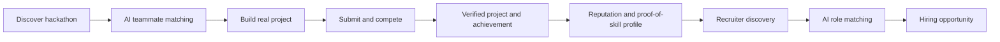

# Hack-Meet

### Build. Prove. Get Discovered.

Hack-Meet is a skill-first hackathon and talent ecosystem. It turns participation and real project work into verified proof of skill, persistent reputation, and new opportunities.

> **Hackathon -> Proof of Skill -> Reputation -> Talent Discovery -> Hiring**

Instead of a hackathon ending when the winners are announced, Hack-Meet keeps the work useful after the event. A project can become evidence on a profile, a signal for team matching, and a reason for a recruiter to reach out.

## The Core Innovation

Traditional hiring often looks like:

```text
Resume -> Application -> Screening -> Interview
```

Hack-Meet connects the full skill-to-opportunity loop:

```text
Discover -> Match -> Build -> Submit -> Verify -> Build Reputation
    -> Get Discovered -> Get Matched -> Get Invited -> Get Hired
```



## Why It Matters

Students and developers need better ways to prove what they can actually build. Organizers need one place to run the full event. Recruiters need evidence-based talent discovery instead of relying only on resumes.

Hack-Meet brings these sides together while adding trust controls for verification, reporting, moderation, and privacy.

## Platform Roles

| Role | Primary workflow |
| --- | --- |
| **Student / Professional** | Discover hackathons, find teammates, build projects, earn reputation, and get discovered. |
| **HR / Recruiter** | Paste a job description, find ranked candidates, shortlist talent, and send invitations. |
| **Organizer / Organization** | Create hackathons, manage teams and submissions, run judging, and publish results. |
| **Admin** | Verify people and organizations, approve hackathons, moderate reports, and manage platform safety. |

## Product Experience

### Student and Professional

- Proof-of-skill profile with skills, projects, achievements, badges, and reputation
- Education, experience, certifications, resume, ATS score, and professional links
- GitHub activity and hackathon history
- Hackathon discovery with filters for domain, format, location, prize, level, and deadline
- AI-style teammate matching based on complementary skills, domain, availability, commitment, and goals
- Team invitations, workspace, Kanban tasks, milestones, chat, and submission views
- Post-hackathon reputation and verified achievement history

### Recruiter

- Job description input and AI-style requirement extraction
- Skills-first candidate ranking with explainable match signals
- Project relevance, hackathon evidence, achievement level, GitHub activity, ATS score, and reputation signals
- Filters and sorting for skills, experience, location, availability, hackathon level, and more
- Candidate profiles with projects, proof, achievements, badges, and professional links
- Shortlists, individual invitations, bulk selection, candidate groups, and group messaging views

### Organizer

- Hackathon creation with rules, eligibility, timeline, team size, prizes, and problem statements
- Registration, team, community, announcement, submission, judging, winner, and analytics screens
- Organizer communities with General, FAQ, Find Members, and Team Formation channels
- Custom groups and announcement flows
- Hackathon lifecycle model:

```text
Draft -> Registration Open -> Registration Closed -> Started
  -> Submission Open -> Submission Closed -> Judging
  -> Results -> Completed
```

### Admin and Trust

- HR and organization verification queues
- Private document review screens
- Hackathon approval workflow
- Reports for harassment, spam, fraud, fake recruiters, and suspicious accounts
- Warn, restrict, suspend, and ban workflow screens
- Audit log and platform settings views
- Role-based access and protected personal contact information in the product design

## Reputation and Verification

Achievements are intended to come from verified activity rather than manual claims.

Examples include:

- Completed hackathons
- Finalist or winner results
- Verified project submissions
- Reliable collaboration
- Consistent building activity

Hackathon achievement levels range from **College** and **Inter-College** through **State**, **National**, and **International**. Evidence can include certificates, public result pages, organizer confirmation, and event links.

## Revenue Concept

The planned model keeps the core platform accessible:

- **Students:** Free basic platform, with a planned premium unlock at `₹49/month` for additional recruiter invitations.
- **Organizers:** Up to 500 unique registrations per hackathon, then `₹100` per additional 100 registrations.
- **Recruiters:** 50 free candidate invitations, then `₹100` per additional 100 invitations.

These are product concepts represented in the prototype direction, not connected billing flows yet.

## Current Implementation

This repository is a front-end prototype built to demonstrate the product experience and major workflows.

Implemented in the current UI:

- Responsive landing page
- Login and role-based registration
- Student, recruiter, organizer, and admin dashboard views
- Multi-step onboarding screens
- Profile, resume, ATS, GitHub, projects, achievements, and reputation surfaces
- Hackathon discovery and details views
- Team matching, workspace, Kanban, community, judging, and results surfaces
- Recruiter matching, filters, profiles, shortlists, invitations, and groups
- Admin verification, approval, reports, moderation, analytics, and audit screens
- Light and dark themes
- Profile menus with profile and logout actions
- Scroll reset between app and dashboard pages

### Prototype limitations

Most data currently comes from fixture files and local React state. These areas still need a connected backend and persistent cross-role state:

- Authentication and authorization
- Team invitation persistence
- Shared recruiter-to-student conversations
- Report and moderation actions
- Hackathon lifecycle transitions
- Admin decisions that update visibility and permissions
- Document storage and verification
- Billing, notifications, and audit persistence

The UI demonstrates the intended experience, but it should not yet be treated as a production system.

## Technology

### Current frontend

- React 18
- TypeScript
- Vite
- Tailwind CSS
- Lucide React
- ESLint

### Planned production architecture

The product direction can evolve toward:

- PostgreSQL with Prisma for relational platform data
- Supabase or a dedicated backend for authentication and APIs
- S3, Cloudflare R2, or Supabase Storage for resumes, images, and verification documents
- Redis for caching and realtime-supporting workloads
- LLM APIs, embeddings, and vector search for resume parsing, JD analysis, matching, and team compatibility
- GitHub API and public professional profile integrations
- Docker, CI/CD, monitoring, and Sentry

Images and documents should live in object storage. The database should store their URLs, metadata, ownership, and verification state rather than binary files.

## Getting Started

### Requirements

- Node.js 18 or newer
- npm

### Install

```bash
npm install
```

### Run locally

```bash
npm run dev
```

Vite will print the local development URL, usually `http://localhost:5173`.

### Build and preview

```bash
npm run build
npm run preview
```

### Quality checks

```bash
npm run typecheck
npm run lint
```

The current prototype has some existing lint findings in unrelated screens. TypeScript checking and production builds are the primary validation checks while the UI is being completed.

## Project Structure

```text
src/
├── App.tsx                         # Landing page and top-level view switching
├── index.css                       # Theme variables, Tailwind layers, and utilities
├── components/
│   ├── LoginPage.tsx               # Login and role selection
│   ├── Navbar.tsx                  # Public landing navigation
│   ├── auth/                       # Registration and onboarding flows
│   ├── sections/                   # Landing page sections
│   └── ui/                         # Shared visual components
├── context/
│   └── ThemeContext.tsx            # Light and dark theme state
└── dashboard/
    ├── Dashboard.tsx               # Student dashboard
    ├── OrganizerDashboard.tsx      # Organizer dashboard
    ├── RecruiterDashboard.tsx      # Recruiter dashboard
    ├── AdminDashboard.tsx          # Admin dashboard
    ├── *Layout.tsx                 # Role-specific navigation
    ├── *Pages.tsx                  # Role-specific dashboard screens
    ├── pages/                      # Student dashboard screens
    └── *-data.ts                   # Prototype fixture data
```

## Developed By

**Team HackMates**

## License

No license has been specified for this project yet.
